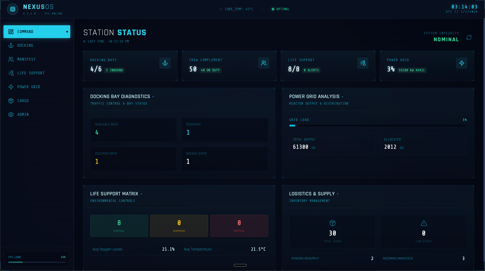
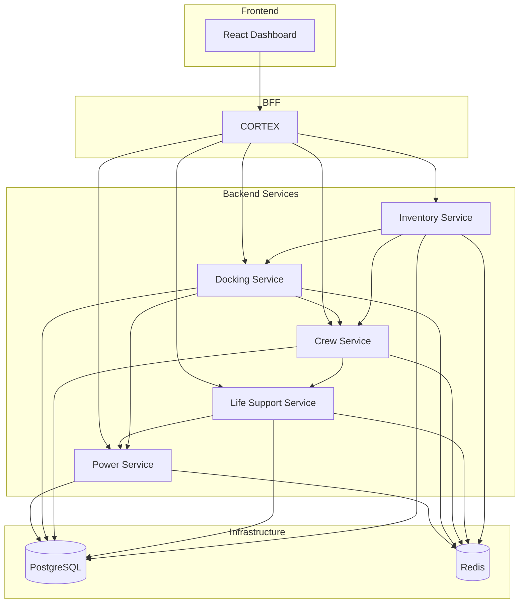

# NEXUS STATION

A microservices-based space station management system designed to demonstrate OpenTelemetry. Built with Java 17, Spring Boot 3.4, React 18, and TypeScript.



## Overview

NEXUS Station simulates operations management for a space station, including:

- **Docking** - Ship arrival/departure, bay management
- **Crew** - Personnel tracking, section assignments
- **Life Support** - Environmental monitoring, O2/CO2/temperature
- **Power** - Grid management, source allocation
- **Inventory** - Supplies, cargo manifests, resupply requests

## Architecture

### Tech Stack

| Component | Technology |
|-----------|------------|
| Backend Services | Java 17, Spring Boot 3.4.1 |
| Frontend | React 18, TypeScript, Vite, Tailwind CSS, Framer Motion, Lucide React |
| Database | PostgreSQL 16 (schema-per-service) |
| Cache | Redis 7 |
| Load Testing | Locust (Python) |
| Observability | OpenTelemetry (enabled in Kubernetes) |
| Container Runtime | Docker / Podman |
| Orchestration | Kubernetes + Helm |

### Service Dependencies

The system follows a microservices architecture with CORTEX acting as the Backend-for-Frontend (BFF) layer. All inter-service communication uses synchronous REST calls.



### Dependency Matrix

| Service | Depends On | Purpose of Dependency |
|---------|------------|----------------------|
| **CORTEX** | power-service | Fetches power grid status, sources, allocations |
| | docking-service | Manages docking bays, ship operations, schedules |
| | crew-service | Retrieves crew roster, sections, relocations |
| | life-support-service | Monitors environment, alerts, adjustments |
| | inventory-service | Tracks supplies, cargo, resupply requests |
| **Life Support** | power-service | Allocates power for environmental systems (priority: 1 - highest) |
| **Docking** | power-service | Allocates power for docking bay operations (priority: 4) |
| | crew-service | Registers arriving crew members from docked ships |
| **Crew** | life-support-service | Notifies of crew occupancy changes for capacity adjustments |
| **Inventory** | docking-service | Schedules cargo deliveries via docking bays |
| | crew-service | Fetches available crew for cargo operations |
| **Power** | *(none)* | Core service with no service dependencies |

### Infrastructure Dependencies

All backend services share the following infrastructure:

| Infrastructure | Purpose | Used By |
|---------------|---------|---------|
| PostgreSQL | Persistent storage (schema-per-service) | All backend services |
| Redis | Caching and session management | All backend services |
| OpenTelemetry Collector | Distributed tracing and metrics | All services (when enabled) |

**Database Schemas:**

- `power` - Power grid, sources, allocations
- `docking` - Bays, ships, docking logs
- `crew` - Members, sections, assignments
- `life_support` - Environment readings, sections, alerts
- `inventory` - Supplies, manifests, resupply requests

### Example: Docking a Ship

When a user docks a ship, the request cascades through multiple services:

```
React Dashboard
    │
    ▼
CORTEX (BFF)
    │  POST /api/docking/ships/{id}/dock
    ▼
Docking Service
    │
    ├──► Power Service
    │       POST /api/power/allocate
    │       (allocates power for bay)
    │
    └──► Crew Service
            │  POST /api/crew/arrival
            │  (registers arriving crew)
            │
            ▼
         Life Support Service
            │  POST /api/life-support/adjust-capacity
            │  (updates capacity for crew occupancy)
            │
            ▼
         Power Service
               POST /api/power/allocate
               (allocates power for environmental systems)
```

Power Service is called twice: once directly from Docking and once at the end of the Crew → Life Support chain.

## Quick Start

### Prerequisites

- Docker or Podman with Compose
- 4GB+ RAM available for containers

### Run Locally

```bash
# Clone and start
git clone <repo-url>
cd nexus_station

# Start all services
docker compose up -d --build

# Or with Podman
podman compose up -d --build
```

Open <http://localhost:8080> to access the dashboard.

### With Load Generator

```bash
docker compose --profile load up -d --build
```

Access Locust UI at <http://localhost:8089>

## Configuration

Copy `.env.example` to `.env` to customize settings:

```bash
cp .env.example .env
```

### Chaos Engineering

Inject failures and latency for testing resilience:

| Level | Error Rate | Latency |
|-------|------------|---------|
| `none` | 0% | 0ms |
| `low` | 5% | 200-500ms |
| `medium` | 15% | 1-3s |
| `high` | 30% | 3-8s |

```bash
# Global chaos level
CHAOS_DEFAULT=low

# Per-service override
DOCKING_CHAOS=high
POWER_CHAOS=medium
```

### Environment Variables

| Variable | Default | Description |
|----------|---------|-------------|
| `CHAOS_DEFAULT` | `none` | Global chaos level |
| `{SERVICE}_CHAOS` | - | Per-service chaos override |
| `LOAD_USERS` | `10` | Concurrent Locust users |
| `LOAD_SPAWN_RATE` | `2` | Users spawned per second |
| `POSTGRES_*` | `nexus` | Database credentials |

## API Reference

All endpoints are proxied through CORTEX at `/api/*`:

### Dashboard

| Endpoint | Method | Description |
|----------|--------|-------------|
| `/api/dashboard/status` | GET | Aggregated system status |

### Docking

| Endpoint | Method | Description |
|----------|--------|-------------|
| `/api/docking/bays` | GET | List all docking bays |
| `/api/docking/ships/incoming` | GET | Ships waiting to dock |
| `/api/docking/ships/{id}/dock` | POST | Dock a ship |
| `/api/docking/ships/{id}/undock` | POST | Undock a ship |
| `/api/docking/logs` | GET | Docking activity log |

### Crew

| Endpoint | Method | Description |
|----------|--------|-------------|
| `/api/crew` | GET | Full crew roster |
| `/api/crew/sections` | GET | Station sections |
| `/api/crew/sections/{id}/members` | GET | Section crew |
| `/api/crew/relocate` | POST | Move crew member |
| `/api/crew/count` | GET | Crew statistics |

### Life Support

| Endpoint | Method | Description |
|----------|--------|-------------|
| `/api/life-support/environment` | GET | All section readings |
| `/api/life-support/environment/sections/{id}` | GET | Section environment |
| `/api/life-support/environment/sections/{id}/adjust` | POST | Adjust settings |
| `/api/life-support/alerts` | GET | Active alerts |
| `/api/life-support/alerts/{id}/acknowledge` | POST | Acknowledge alert |

### Power

| Endpoint | Method | Description |
|----------|--------|-------------|
| `/api/power/grid` | GET | Grid status overview |
| `/api/power/sources` | GET | All power sources |
| `/api/power/sources/{id}` | GET | Source details |
| `/api/power/allocate` | POST | Allocate power |
| `/api/power/deallocate/{id}` | DELETE | Release allocation |

### Inventory

| Endpoint | Method | Description |
|----------|--------|-------------|
| `/api/inventory/supplies` | GET | All supplies |
| `/api/inventory/low-stock` | GET | Low stock items |
| `/api/inventory/resupply` | POST | Request resupply |
| `/api/inventory/cargo-manifests` | GET | Cargo manifests |
| `/api/inventory/cargo-manifests/{id}/unload` | POST | Unload cargo |

## Development

### Project Structure

```
nexus_station/
├── services/
│   ├── cortex/                # BFF + React frontend
│   │   ├── frontend/          # React/TypeScript app
│   │   └── src/               # Spring Boot BFF
│   ├── crew-service/
│   ├── docking-service/
│   ├── inventory-service/
│   ├── life-support-service/
│   └── power-service/
├── charts/nexus-station/      # Kubernetes deployment
├── load-generator/            # Locust load tests
└── docker-compose.yml
```

### Build Commands

```bash
# Build a single service
cd services/power-service
./mvnw clean package

# Build without tests
./mvnw package -DskipTests

# Run tests
./mvnw test

# Run single test
./mvnw test -Dtest=PowerServiceTest#testAllocatePower
```

### Frontend Development

```bash
cd services/cortex/frontend

# Install dependencies
npm install

# Development server (proxies to localhost:8080)
npm run dev

# Production build
npm run build

# Lint
npm run lint
```

### Service Ports

| Service | Port |
|---------|------|
| CORTEX (Frontend + API) | 8080 |
| Docking | 8080 |
| Crew | 8080 |
| Life Support | 8080 |
| Power | 8080 |
| Inventory | 8080 |
| PostgreSQL | 5432 |
| Redis | 6379 |
| Locust UI | 8089 |

## Kubernetes Deployment

### Prerequisites

- Kubernetes cluster (1.25+)
- Helm 3
- Container registry access

### Deploy with Helm

```bash
# Build and push images
docker build -t your-registry/cortex:0.1.0 ./services/cortex
docker build -t your-registry/power-service:0.1.0 ./services/power-service
# ... repeat for other services

# Install
helm install nexus-station ./charts/nexus-station \
  --set global.imageRegistry=your-registry

# With OpenTelemetry enabled
helm install nexus-station ./charts/nexus-station \
  --set global.otel.disabled=false

# With chaos enabled
helm install nexus-station ./charts/nexus-station \
  --set global.chaos.enabled=true \
  --set global.chaos.errorRate=0.1
```

### Helm Values

Key configuration options in `values.yaml`:

```yaml
global:
  otel:
    disabled: false       # Enable OTel for K8s
  chaos:
    enabled: false
    errorRate: 0.0
    latencyMs: 0

cortex:
  replicaCount: 2
  resources:
    limits:
      memory: 512Mi

loadGenerator:
  enabled: false
  users: 10
```

## Observability

### Local Development

OpenTelemetry is disabled by default in Docker Compose (`OTEL_SDK_DISABLED=true`). Services still log to stdout.

### Kubernetes

When deployed to Kubernetes with `global.otel.disabled=false`:

- Traces are exported via OTLP
- Spans include service dependencies
- Custom spans for business operations (when `customTelemetry.enabled=true`)

Recommended setup:

- OpenTelemetry Operator for auto-instrumentation
- Jaeger, Tempo, or similar for trace visualization
- Prometheus for metrics

## Troubleshooting

### Services won't start

```bash
# Check logs
docker compose logs -f cortex
docker compose logs -f power-service

# Restart everything
docker compose down
docker compose up -d --build
```

### Database issues

```bash
# Reset database (data is ephemeral)
docker compose down
docker compose up -d postgres
# Wait for healthy, then start services
docker compose up -d
```

### Frontend not loading

1. Ensure CORTEX is healthy: `curl http://localhost:8080/actuator/health`
2. Check browser console for errors
3. Verify backend services are running: `docker compose ps`

## License

MIT
